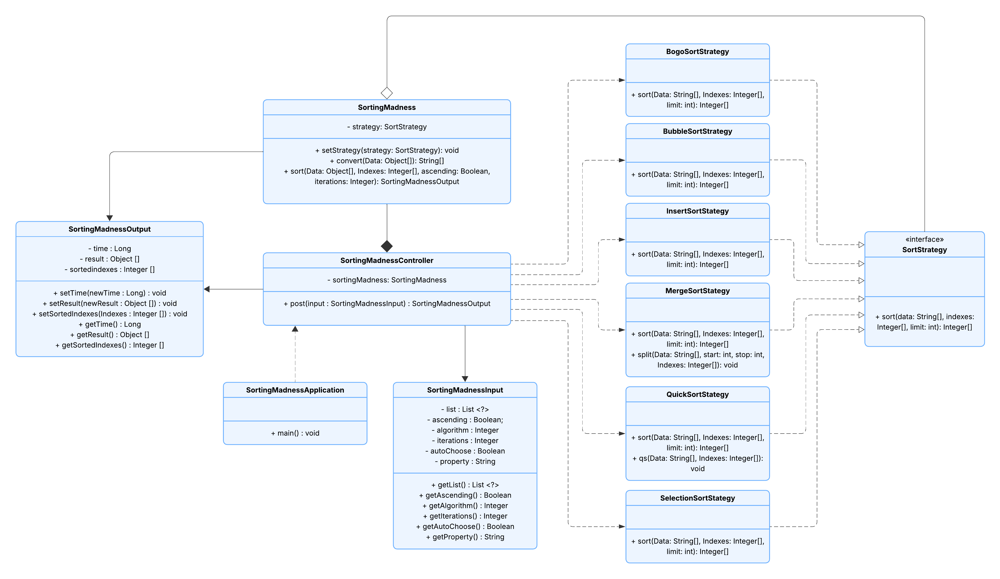

# Sorting Madness
Aplikacja służąca do sortowania zbiorów danych różnymi algorytmami. Ma pomóc użytkownikowi w ocenie, która metoda może się najlepiej sprawdzić w konkretnych przypadkach oraz, oczywiście, w uporządkowaniu danych. Dane liczbowe są sortowane standardowo, natomiast tekstowe - leksykograficznie. Należy zaimplementować co najmniej 6 różnych metod sortowania. Aplikacja będzie dostępna poprzez GUI, a także jako zdalne API, dzięki czemu można zintegrować z istniejącymi narzędziami.


Uruchomienie JAR
```
java -jar io-project-architecture-1.0.jar
```
Rozpakowanie JavaDocs
```
jar xf io-project-architecture-1.0-javadoc.jar
```

---
<br>

